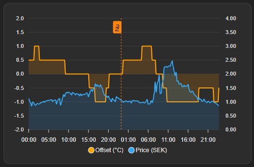

# Energy Balancer (Home Assistant Custom Integration)

Energy Balancer computes a temperature offset for a heating system based on electricity price variations while keeping total energy neutral over a rolling window. The offset is positive when prices are low (pre-heating) and negative when prices are high (letting temperature float down).

This integration is GUI-only and uses a Nordpool sensor to locate the Nordpool config entry, then calls the Nordpool service to fetch price data.

## Features

- Computes a current offset plus offset forecasts for today/tomorrow (as attributes)
- Energy-neutral rolling window with optional smoothing
- Step-size snapping (e.g., 0.1 / 0.5 / 1.0)
- Daily fetch of tomorrow prices at 13:30 Stockholm time
- Midnight roll-over to avoid gaps
- Optional VAT inclusion per area
- Optional night cap (clamp positive offsets during 22:30-05:00)

## Requirements

- Home Assistant
- Nordpool integration installed and configured

## Installation

### HACS

1. Add this repository as a custom repository in HACS (type: Integration).
2. Install "Energy Balancer".
3. Restart Home Assistant.
4. Add the integration via the UI (Settings -> Devices & Services -> Add Integration -> Energy Balancer).

### Manual

1. Copy `custom_components/energy_balancer` into your HA `custom_components` directory.
2. Restart Home Assistant.
3. Add the integration via the UI (Settings -> Devices & Services -> Add Integration -> Energy Balancer).

## Configuration (UI)

Required:
- Nordpool sensor entity
- Area (e.g., SE1)
- Currency (e.g., SEK)
- Include VAT (checkbox)

## Entities

Sensors:
- `sensor.energy_balancer_offset`
  - State: current offset (°C)
  - Attributes:
    - `slot_ms`
    - `raw_today` / `raw_tomorrow` (offset forecast)
- `sensor.energy_balancer_prices`
  - State: current price
  - Attributes:
    - `slot_ms`
    - `raw_today` / `raw_tomorrow` (price forecast)

Note: There is no separate forecast sensor; use the attributes above for charts.

Helpers:
- `number.energy_balancer_max_offset` (°C)
- `number.energy_balancer_horizon_hours` (hours)
- `number.energy_balancer_smoothing_level` (0-10)
- `select.energy_balancer_step_size` (0.1 / 0.5 / 1.0)
- `switch.energy_balancer_night_cap` (on/off)

## ApexCharts example

Below is an example ApexCharts card that plots the offset and price series.

```yaml
type: custom:apexcharts-card
hours_12: false
graph_span: 2d
now:
  show: true
  color: "#fe7c0c"
  label: Nu
span:
  start: day
  offset: "-0h"
header:
  show: false
  title: Energy Balancer – Offset forecast vs price
  show_states: false
apex_config:
  chart:
    type: area
  stroke:
    width: 2
    curve: smooth
  markers:
    size: 0
  dataLabels:
    enabled: false
  fill:
    type: solid
    opacity: 0.18
  grid:
    strokeDashArray: 0
    borderColor: rgba(255,255,255,0.10)
  xaxis:
    type: datetime
    axisBorder:
      show: false
  yaxis:
    - id: offset
      decimalsInFloat: 1
      tickAmount: 8
      min: -2
      max: 2
    - id: price
      opposite: true
      decimalsInFloat: 2
      tickAmount: 8
series:
  - entity: sensor.energy_balancer_offset
    name: Offset (°C)
    unit: °C
    yaxis_id: offset
    type: area
    data_generator: >
      const today = Array.isArray(entity.attributes.raw_today) ?
      entity.attributes.raw_today : [];

      const tomorrow = Array.isArray(entity.attributes.raw_tomorrow) ?
      entity.attributes.raw_tomorrow : [];

      // Merge both lists
      const rows = [...today, ...tomorrow]
        .filter(r => r && r.start_ts != null && r.value != null)
        .map(r => [Number(r.start_ts), Number(r.value)]);

      // Sort + de-dup on timestamp (keep last)
      rows.sort((a,b) => a[0]-b[0]);

      const data = [];
      for (const p of rows) {
        if (data.length && data[data.length-1][0] === p[0]) data[data.length-1] = p;
        else data.push(p);
      }

      // Break line after last point so it doesn't extend
      if (data.length) data.push([data[data.length - 1][0] + 15 * 60 * 1000, null]);

      return data;
    show:
      in_header: false
      legend_value: false
  - entity: sensor.energy_balancer_prices
    name: Price (SEK)
    yaxis_id: price
    type: area
    data_generator: >
      const today = Array.isArray(entity.attributes.raw_today) ?
      entity.attributes.raw_today : [];

      const tomorrow = Array.isArray(entity.attributes.raw_tomorrow) ?
      entity.attributes.raw_tomorrow : [];

      // Merge both lists
      const rows = [...today, ...tomorrow]
        .filter(r => r && r.start_ts != null && r.value != null)
        .map(r => [Number(r.start_ts), Number(r.value)]);

      // Sort + de-dup on timestamp (keep last)
      rows.sort((a,b) => a[0]-b[0]);

      const data = [];
      for (const p of rows) {
        if (data.length && data[data.length-1][0] === p[0]) data[data.length-1] = p;
        else data.push(p);
      }

      // Break line after last point so it doesn't extend
      if (data.length) data.push([data[data.length - 1][0] + 15 * 60 * 1000, null]);

      return data;
    show:
      in_header: false
      legend_value: false
```

### Example output

Step size 0.1:


Step size 0.5:



## Scheduling and Data Flow

- On startup, the integration fetches today prices and retries every 10 seconds for up to 2 minutes.
- If after 13:30 Stockholm time, it then fetches tomorrow prices (retrying for up to 2 minutes).
- At 13:30 Stockholm time, it fetches tomorrow prices (retrying until 13:40).
- At 00:00:10 Stockholm time, tomorrow data is rolled into today (and a fetch is attempted if missing).

## VAT

When "Include VAT" is enabled, prices are multiplied by `(1 + VAT)` for the selected area.
Prices are converted to currency/kWh by dividing by 1000 before VAT is applied.

Configured VAT rates include:
- AT 20%, BE 21%, BG 20%, DK1/DK2 25%, EE 24%, FI 25.5%, FR 20%, GER 19%, LT 21%, LV 21%, NL 21%, PL 23%, NO1-5 25%, SE1-4 25%

## Recorder note

The forecast arrays can be large. If you see recorder warnings, you can exclude the price/offset sensors from the recorder database.

## Development notes

- The integration calls the Nordpool service `nordpool.get_prices_for_date` using the Nordpool config entry ID.
- Prices are normalized to the internal format with timestamps in epoch ms.

## License

MIT
